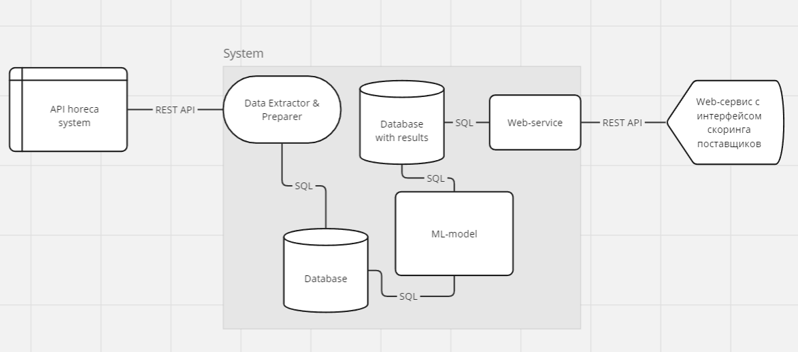
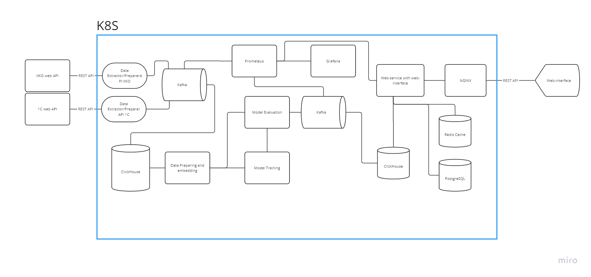

# Дизайн-документ для интеграции машинного обучения в производство пиццы

---
## 1. Обзор

**Цель бизнеса**: Увеличить эффективность производства пиццы в сети ресторанов, сократив время приготовления и улучшив качество продукции.  

**Проблема:** Постоянная необходимость отслеживания качества продукции поставляемой определённым поставщиком и скоринга его.  
**Гипотеза:** При внедрении машинного обучения в процесс выбора поставщиков и контроля качества продукции, можно улучшить качество пиццы.  
**Решение:** Внедрение системы машинного обучения для скоринга поставщиков продуктов и контроля качества продукции.  
**Ожидаемые результаты:** Сокращение разрывов времени поставок на 15%, сокращение отзывов о несоответствующем качестве продукции на 10%.

## 2. Бизнес требования и ограничения

- Система взаимодействует с системами внутреннего и складского учёта по REST API.
- Результаты скоринга поставщиков и контроля качества продукции должны быть доступны в виде таблиц в веб-интерфейсе системы.
- Вход в систему осуществляется через web-интерфейс посредством логина и пароля.
- Метрики должны быть рассчитаны как для одного заведения, так и для всей сети.
- Отклик системы не должен превышать 1 секунду.

## 3. Метрики успеха

- Доля отзывов о несоответствующем качестве продукции ниже на 10% относительно предыдущего периода без внедрения системы.
- Сокращение абсолютного времени поставок на 15% относительно предыдущего периода без внедрения системы.
- Сокращение расходов на списание некачественной продукции на 10% относительно предыдущего периода без внедрения системы.

## 4. Методология

### 4.1. Постановка проблемы

Скоринг поставщика продуктов может представлять собой задачу регрессии с нормировкой результатов в интервале от 1 до 5.

### 4.2. Данные

Для модели понадобятся данные: 
- История поставок продукции поставщиками. (id поставщика, id продукта, дата поставки, количество, цена)
- Позиция в меню и ее состав продуктов. (id продукта, id позиции)
- Отзыв о качестве позиции в меню. (id позиции, id отзыва, оценка, категория отзыва)
- Стоимости продуктов поставщиков. (id поставщика, id продукта, цена)
- Данные о поставщиках. (id поставщика, название, адрес, контакты)
- Данные о пиццериях (id пиццерии, адрес, контакты)
- Данные о заказах (id заказа, id пиццерии, id позиции, дата заказа, количество, цена)
- Данные о списании продукции (id списания, id продукта, дата списания, количество, причина списания)

### 4.3. ML-модели

Для решения задачи скоринга поставщика продуктов можно использовать линейную регрессию, случайный лес, градиентный бустинг.

## 5. Реализация

### 5.1. Верхнеуровневое описание архитектуры решения

Система представляет собой кластер k8s, включающий в себя следующие компоненты:
- веб-сервис на извлечение и обработку данных из внешней системы взаимодействует по REST API.
- БД для хранения данных (ClickHouse, PostgreSQL, MongoDB).
- Сервис с машинным обучением (Python, TensorFlow, PyTorch, CatBoost).
- БД для хранения результатов скоринга (PostgreSQL).
- Веб-сервис с вебинтерфейсом для обеспечения доступа конечного потребителя к результатам работы решения (React, Node.js).

### 5.2. Инфраструктура

- Система будет размещена в управляемом кластере k8s от selectel.

### 5.3. Производительность (пропускная способность, задержка)

Можно быстро масштабировать систему, добавляя новые поды в кластер k8s. Для вертикального масштабирования достаточно увеличить объемы ресурсов кластера у selectel либо поставить систему автоскейлинга с оплатой pay-as-you-go.

### 5.4. Безопасность

Доступ к внешним системам осуществляется по протоколу HTTPS и api токену или логину и паролю от учётной записи администратора. Внутренний трафик в кластере защищен с помощью сетевых политик k8s. Доступ к веб-интерфейсу осуществляется по протоколу HTTPS с использованием логина и пароля в системе.

### 5.5. Конфиденциальность данных

Данные не представляют собой ПнД, поэтому не требуют усиленной защиты. Для обеспечения конфиденциальности коммерческих данных в системе используются механизмы аутентификации и авторизации.

### 5.6. Мониторинг и сигнализация

Для логирования в системе будет использоваться ELK. Метрики будут собираться с помощью Prometheus и Grafana. Для сигнализации будут использоваться алерты Prometheus.

### 5.7. Точки интеграции

Для сбора данных внешних систем управления или складского учёта будет использоваться REST API.  
Для предоставления результатов работы системы конечному потребителю будет использоваться веб-интерфейс и возможность экспорта данных через REST API в формате json.

## Подробная схема системы

